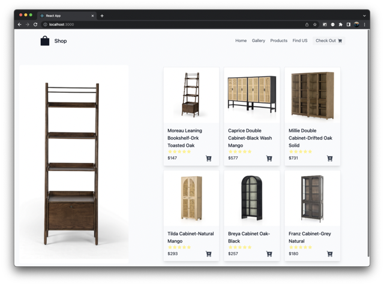
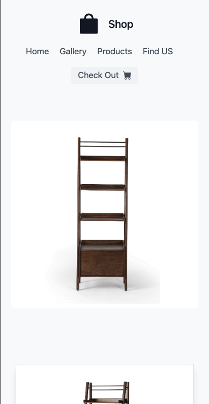

# Frontend Shop
Front End Assessment

## File structure :
1. src/App.js is the root file which will be starting point of the web app
2. src/components/Item.jsx is component to display each card of the product.
3. src/components/NavBar.jsx is component to display Navigation Bar and the checkout button.
3. src/components/Offcanvas.jsx is them component to display the checkout page which will appear from right side.
3. src/components/Sidecard.jsx is component to display the feature image at home.

## How to start
1. Clone or download using link: https://github.com/r97draco/frontend-react-shop
<br>```git clone https://github.com/r97draco/frontend-react-shop```
2. Run following command to install node modules in the root directory of Project.
<br>```npm install```
3. Run following in terminal to start the server on localhost:3000
<br>```npm run start```

## Show Case
1. Desktop SS
<br><br><br>
2. Desktop-checkout SS
<br><br><br>

3. Phone SS
<br><br><br>
4. Phone-checkout SS
<br><br><br>
